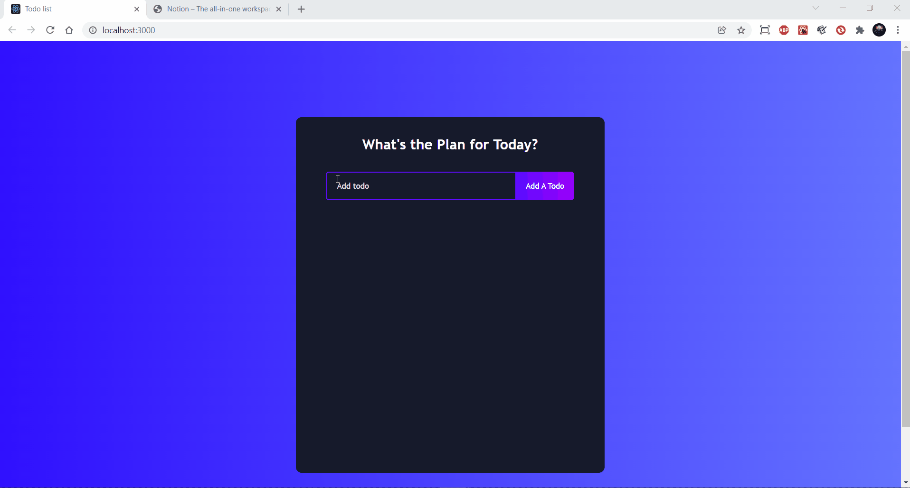

## Todo list
Esse projeto e uma aplicação feita usando ReactJS, funciona como lista de tarefas para fazer. 
 Neste projeto foi usando hooks como useState, useEffect e o useRef, foi usando também ícones do React-icon

## Desktop

 
 

## TECNOLOGIAS

 HTML5
 CSS3
 JavaScript
 ReactJS